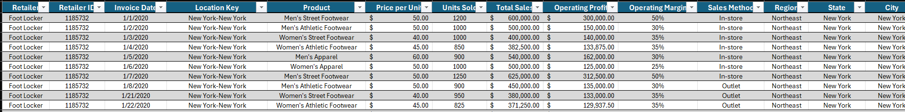
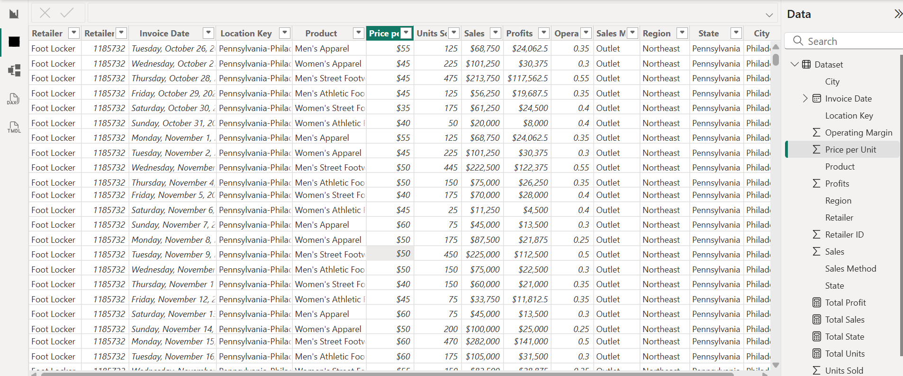
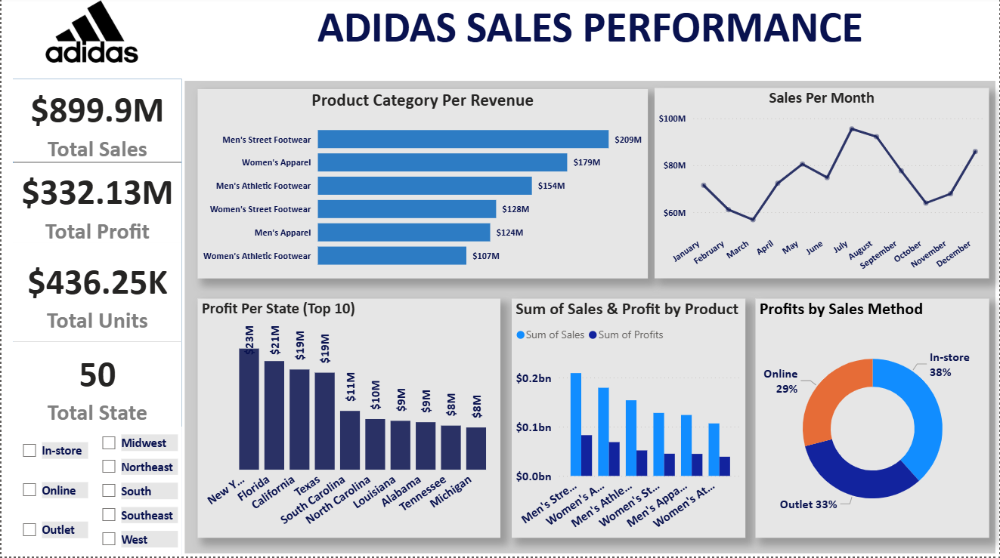

# Adidas Sales Performance Analysis 📊

## Project Overview

This project analyzes Adidas sales performance using **Power BI** to uncover insights into sales, profitability, product performance, sales channels, regional performance, and monthly trends. The goal was to transform raw sales data into an interactive dashboard that provides a clear view of business performance and supports data-driven decision-making.

## Dataset

The dataset contains **9,648 sales records** covering the period from **January 2020 to December 2021**.

Key fields include:

## Tools Used

* **Power BI** – Data visualization and dashboard development
* **DAX** – Measures and KPI calculations
* **Power Query** – Data preparation and transformation
* **Excel** – Initial dataset inspection and preparation

## Data Preparation

The dataset was cleaned for analysis by reviewing data types, checked the available fields, and structured the data for use within Power BI. The Power BI model was then used to create calculated measures, KPI Cards and interactive visualizations.

## DAX & KPI Measures

The dashboard uses measures to calculate key business metrics, including:

* **Total Sales** – Overall revenue generated from sales
* **Total Profit** – Total operating profit generated
* **Total Units** – Total number of units sold
* **Total State** – Number of states represented in the dataset

These measures were used throughout the dashboard to create dynamic KPI cards and support the visual analysis.

## Dashboard Analysis

The dashboard, titled **Adidas Sales Performance**, contains several interactive visualizations:

### 1. KPI Cards

* Total Sales: **$899.90M**
* Total Profit: **$332.13M**
* Total Units Sold: **2.48M**
* States Covered: **50**

### 2. Sales by Product

**Men's Street Footwear** generated the highest sales at approximately **$208.83M**, followed by **Women's Apparel** at approximately **$179.04M**.

### 3. Profit by Sales Method

A donut chart analyzes operating profit across the three sales methods:

* In-store
* Outlet
* Online

This provides insight into how different sales channels contribute to overall profitability.

### 4. Monthly Sales Trend

A line chart tracks sales performance over time, allowing changes in sales throughout the 2020–2021 period to be identified.

The strongest monthly sales performance occurred in **July 2021**, with approximately **$78.33M** in sales.

### 5. Sales & Profit by Product

A clustered column chart compares sales and operating profit across the different product categories, making it easier to identify products that generate both strong revenue and profitability.

### 6. Top 10 States by Profit

A geographic performance analysis highlights the states generating the highest operating profit.

**New York** recorded the highest operating profit at approximately **$23.33M**, followed by Florida and California.

### 7. Interactive Filters

The dashboard includes slicers for:

* **Sales Method**
* **Region**

These allow users to interactively filter the dashboard and investigate performance from different business perspectives.

## Key Insights

* Adidas generated approximately **$899.9M in sales** across the analyzed period.
* Total operating profit was approximately **$332.1M**.
* **Men's Street Footwear** was the highest-performing product by sales.
* The **West region** generated the highest overall sales at approximately **$269.94M**.
* **New York** was the top state by operating profit.
* **In-store sales** generated the highest sales value among the three sales methods.
* **Online sales** recorded the highest number of units sold, showing strong volume despite generating less total revenue than in-store and outlet channels.
* Sales performance showed significant growth during 2021, with July and December among the strongest months.

## Business Recommendations

Based on the analysis, Adidas could:

1. **Prioritize high-performing products** such as Men's Street Footwear while identifying opportunities to improve weaker product categories.
2. **Strengthen online sales strategies** since the online channel generated the highest unit volume.
3. **Focus regional strategies on high-performing markets**, particularly the West region.
4. **Investigate high-profit states** such as New York, Florida, and California to identify successful market strategies that could be replicated elsewhere.
5. **Use monthly sales trends for inventory and marketing planning**, especially around high-performing periods.

## Project Outcome

This project demonstrates my ability to take raw sales data and transform it into an **interactive Power BI business intelligence dashboard**. It showcases skills in data preparation, DAX, KPI development, data visualization, trend analysis, and extracting actionable business insights from data.

## Dashboard Preview

## Files

* `Adidas Dashboard.pbix` – Power BI dashboard [⬇️ Download Here](https://github.com/soneyeopeyemi101/ADIDDAS-SALES-PERFOMANCE/raw/main/Adidas%20Dashboard.pbix)
* `Adidas Dataset.xlsx` – Dataset used for the analysis [⬇️ Download Here](https://github.com/soneyeopeyemi101/ADIDDAS-SALES-PERFOMANCE/raw/main/Adidas_Dataset.xlsx)
* `dashboard.png` – Dashboard preview

